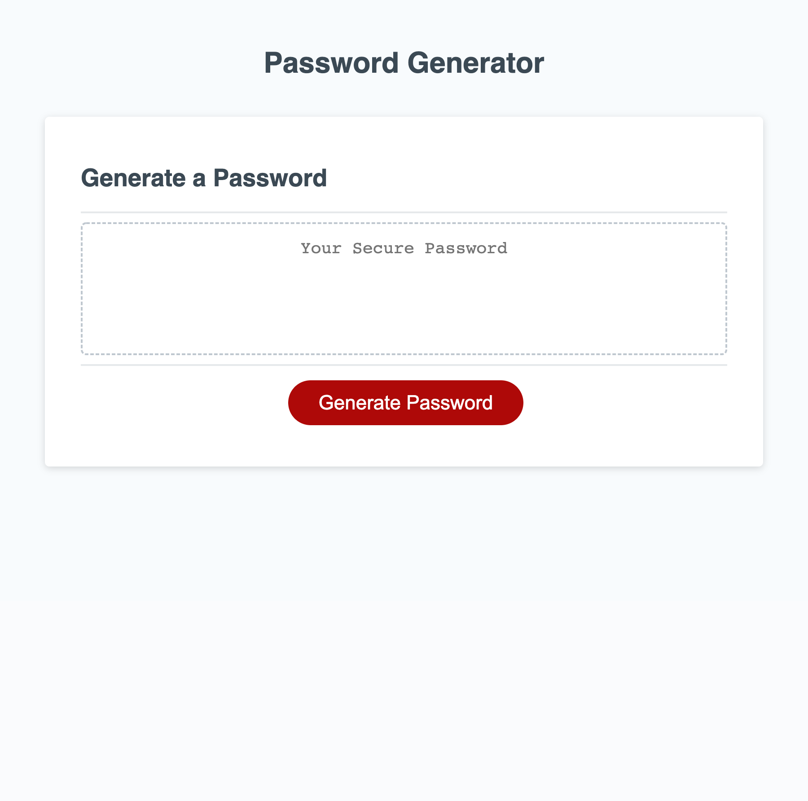

# Password Generator Starter Code

## Purpose

To generate a secure password between 8-128 characters that merets selection criteria of the user to include or omit Uppercase, lowercase, special, numeric characters.

## Built with

HTML, CSS, JavaScript

## Website

## Contribution

Made with ❤️ by Philip Gelin with starter code provided by Trilogy Educational Services
